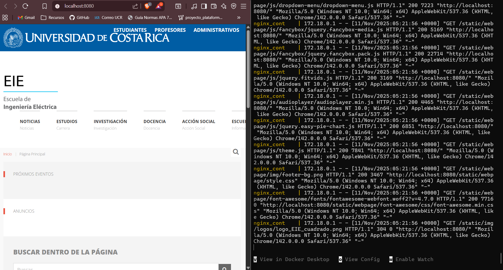
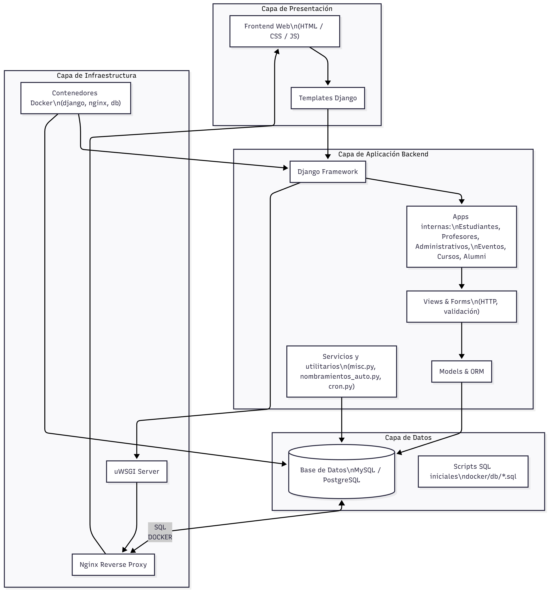
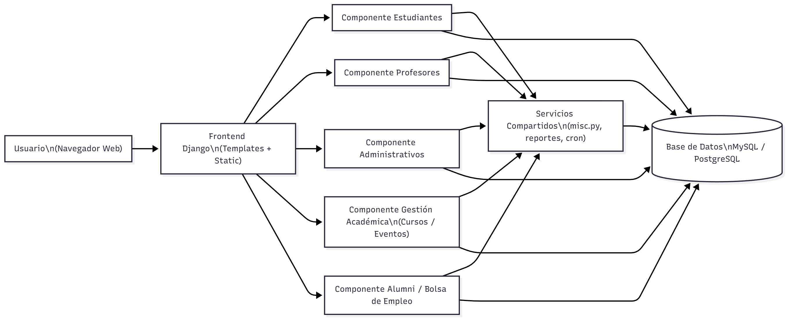
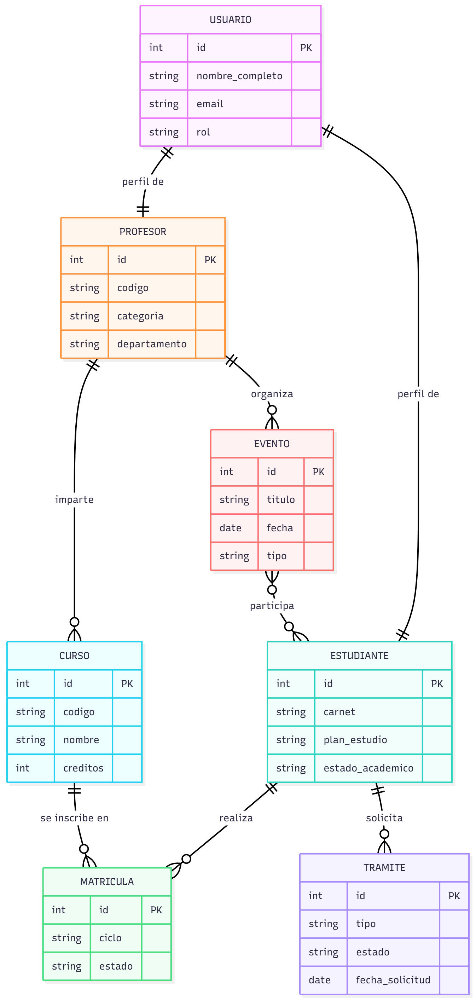

Trabajo de la semana 1 del proyecto final de ie0417

# Informe Técnico

# Índice

1. [Resumen ejecutivo del sistema](#-resumen-ejecutivo-del-sistema)
2. [Descripción funcional del sistema](#-descripción-funcional-del-sistema)
   - [Módulos](#módulos)
   - [Flujos](#flujos)
   - [Módulo de Estudiantes](#módulo-de-estudiantes)
   - [Tipos de Usuario](#tipos-de-usuario)
3. [Instalación del sistema en local](#instalación-del-sistema-en-local)
4. [Mapa de navegación del sistema](#-mapa-de-navegación-del-sistema)
5. [Arquitectura actual documentada](#-arquitectura-actual-documentada)
   - [Diagrama de arquitectura general](#diagrama-de-arquitectura-general)
   - [Diagrama de componentes o módulos actuales](#diagrama-de-componentes-o-módulos-actuales)
   - [Modelo general de datos](#modelo-general-de-datos)
6. [Análisis técnico y observaciones críticas](#-análisis-técnico-y-observaciones-críticas)
   - [Lenguajes, Frameworks, librerías y dependencias](#lenguajes-frameworks-librerías-y-dependencias)
   - [Estructura de carpetas y responsabilidades](#estructura-de-carpetas-y-responsabilidades)
   - [Estructura de directorios](#estructura-de-directorios)
   - [Arquitectura aplicada](#arquitectura-aplicada)
   - [Información del sistema](#información-del-sistema)
7. [Lista de problemas y oportunidades de mejora identificadas](#-lista-de-problemas-y-oportunidades-de-mejora-identificadas)
   - [Aspectos de análisis](#aspectos-de-análisis)
   - [Código duplicado](#1-código-duplicado)
   - [Falta de modularidad](#2-falta-de-modularidad)
   - [Problemas de UIUX](#3-problemas-de-uiux)
   - [Falta de validación o seguridad](#4-falta-de-validación-o-seguridad)
   - [Carencia de documentación](#5-carencia-de-documentación)
   - [Lógica mezclada entre capas](#6-lógica-mezclada-entre-capas)
   - [Oportunidades de mejora técnicas](#técnicas-arquitectura-código-patrones-bd)
   - [Oportunidades de mejora funcionales](#funcionales-módulos-y-mejoras-al-sistema)


# -> Resumen ejecutivo del sistema


El sistema es un **Portal Web Institucional** desarrollado sobre el *framework* **Django (Python)**, diseñado para centralizar la información y los servicios de las áreas académicas y administrativas de una entidad educativa (Escuela). La arquitectura sigue el patrón **MTV (Model-Template-View)** y está desplegada utilizando **contenedores Docker** (con Nginx/uWSGI), lo que facilita su instalación y gestión.

El portal ofrece una navegación segmentada por áreas (`/estudiantes/`, `/profesores/`, `/administrativos/`, `/egresados/`) y por temas institucionales (Noticias, Estudios, Investigación, Docencia, Acción Social). Su funcionalidad central radica en el **Módulo de Estudiantes**, que requiere **autenticación** mediante correo institucional (`@ucr.ac.cr`) para acceder a información personalizada como **cuotas, conferencias y trámites estudiantiles**.

A pesar de ser funcional, el análisis técnico revela problemas significativos de **seguridad** (manejo inseguro de contraseñas y secretos, riesgo de inyección SQL) y **mantenibilidad** (alta duplicación de código, lógica de negocio dispersa en *views*, modelos y utilitarios, y fuerte acoplamiento entre módulos). Las principales oportunidades de mejora giran en torno a **centralizar la lógica de negocio en una capa de servicios (`services/`)**, **corregir el manejo de la autenticación** con las herramientas nativas de Django, y **mejorar la seguridad** eliminando secretos del código y parametrizando las consultas a la base de datos. El sistema está preparado para la extensión modular, pero el refactor es crucial para la estabilidad a largo plazo.


El sistema organiza sus contenidos y accesos a través de un **menú superior** que agrupa la información institucional y segmenta los usuarios mediante **módulos dedicados**.


El sistema soporta cinco tipos principales de usuarios que acceden a áreas específicas:

| Módulo Principal | Usuario | Descripción Funcional |
| :--- | :--- | :--- |
| **Inicio / Noticias** | Público general | Difusión institucional y navegación global. |
| **Estudiantes** | Estudiante | Portal académico: Autenticación, consulta de cuotas, conferencias y trámites. |
| **Profesores** | Profesor | Gestión de cursos y materiales didácticos. |
| **Administrativos** | Personal interno | Gestión interna de información y contenidos del sistema. |
| **Egresados** | Egresado | Bolsa de empleo y servicios post-graduación. |

### Módulo de Estudiantes (Flujo Típico)

Es el módulo más crítico. El flujo se centra en la identidad del estudiante:

1.  **Acceso y Autenticación:** El usuario accede a la sección y debe **iniciar sesión o registrarse** usando su **Carnet** y **Correo Institucional** (`@ucr.ac.cr`).
2.  **Consulta Interna:** Una vez autenticado, accede a **información personalizada** (**Cuotas**, **Conferencias**, **Trámites Estudiantiles**).
3.  **Servicios Externos:** Incluye enlaces a servicios complementarios (Bolsa de Empleo, Radio Estudiantil, Plataformas UCR).


El sistema utiliza una arquitectura basada en contenedores y un *stack* tecnológico estándar para desarrollo web en Python.

* **Framework Principal:** **Django (Python)**, que impone el patrón **MTV**.
* **Despliegue:** **Docker** con contenedores para la aplicación Django, el servidor web **Nginx** (como *reverse proxy*) y la base de datos (**MySQL** o **PostgreSQL**).
* **Organización del Código:** Estructura modular, donde cada funcionalidad principal es una *app* de Django (`estudiantes/`, `profesores/`, `administrativos/`, etc.).
* **Persistencia:** Gestionada por el **ORM de Django** (`models.py`), aunque también se utilizan scripts SQL directos para inicialización de datos.


### Problemas Identificados

1.  **Seguridad Crítica:** **Manejo inseguro de contraseñas** (se usa un modelo `Funcionario` personalizado en lugar del *framework* de autenticación estándar de Django) y **exposición de credenciales** (`secret_credentials.py` en el repositorio).
2.  **Acoplamiento y Mantenibilidad:** **Lógica de negocio fragmentada** (distribuida entre `models.py`, `views.py` y múltiples archivos utilitarios como `misc.py`) y **código duplicado** (constantes y utilidades).
3.  **Riesgo de Inyección SQL:** Uso de código SQL sin parametrización o uso directo de scripts SQL.

### Oportunidades Técnicas Prioritarias

Las acciones de refactorización más urgentes y de mayor impacto son:

* **Extraer una Capa de Servicios:** Mover toda la lógica de negocio compleja a módulos `services/` para desacoplar las *views* y mejorar el *testing*.
* **Corregir Autenticación/Seguridad:** Implementar el **sistema de autenticación nativo de Django** (`AbstractUser`) para el manejo seguro de usuarios y contraseñas.
* **Centralizar Componentes:** Crear módulos `core/` para constantes y utilidades, eliminando duplicaciones entre las diferentes *apps* de Django.
* **Gestión de Secretos:** Implementar el uso de **variables de entorno seguras** y eliminar los archivos de credenciales del control de versiones.
* **Pruebas y QA:** Implementar **pruebas unitarias** e **integración continua (CI)** para garantizar la calidad y facilitar los *refactors* críticos.

---

# -> Descripción funcional del sistema

## Módulos

El portal cuenta con un **menú superior** que organiza el acceso a las diferentes áreas institucionales:

- **Noticias / Eventos**
- **Estudios** (Carrera)
- **Investigación**
- **Docencia**
- **Acción Social**
- **Escuela** (Información general)
- **Egresados**

### Estructura general de módulos

| Módulo | Descripción |
|---------|-------------|
| **Inicio / Menú principal** | Página raíz con navegación global. |
| **Estudiantes** | Portal académico y administrativo para estudiantes activos. |
| **Profesores** | Área docente con funciones de gestión de cursos. |
| **Administrativos** | Módulo interno para personal de la escuela. |
| **Egresados** | Bolsa de empleo y servicios postgraduación. |
| **Noticias / Eventos** | Difusión institucional y comunicados. |
| **Investigación / Docencia / Acción Social** | Información de proyectos, programas y actividades. |

---
## Flujos

El sistema mantiene información de distintas categorías:

### 🔹 Datos de usuario
- Nombre completo  
- Carnet (formato validado)  
- Correo institucional (@ucr.ac.cr)  
- Contraseña (encriptada)  
- Estado de cuenta (activa / pendiente / bloqueada)

### 🔹 Datos de autenticación
- Tokens de recuperación de contraseña  
- Logs de acceso o intentos de login  

### 🔹 Datos académicos / administrativos
- Cuotas y pagos asociados  
- Actividades y conferencias  
- Trámites o solicitudes estudiantiles  

### 🔹 Datos de servicios externos
- Enlaces a bolsa de empleo y radio estudiantil  
- Referencias a sistemas UCR (Educación Continua, Posgrado, etc.)

---
## Módulo de Estudiantes

La sección **Estudiantes** es uno de los módulos centrales del sistema.  
Incluye los siguientes componentes funcionales:

### 1. Autenticación
- **Inicio de sesión:** correo institucional (@ucr.ac.cr) y contraseña.  
- **Recuperación de contraseña:** enlace “¿Olvidó su contraseña?”.
- **Registro de usuario:** formulario con nombre, carnet, correo y verificación de contraseña.

### 2. Acceso a información interna
Una vez autenticado, el estudiante puede acceder a:
- **Cuotas:** información sobre pagos o trámites administrativos.
- **Conferencias:** avisos y actividades académicas disponibles.
- **Trámites estudiantiles:** gestión de documentos o solicitudes internas.

### 3. Enlaces externos relevantes (sin registrarse)
- **Bolsa de Empleo:** redirige al portal de egresados.
- **RADIO201:** enlace informativo al medio estudiantil de la EIE.
- **Enlaces UCR:** acceso a plataformas institucionales (Mediación Virtual, Educación Continua, Posgrados, etc.).
- **Contacto:** dirección, teléfono y datos de atención.

### Flujo típico de un estudiante

1. **Accede a `/estudiantes/`.**  
2. **Inicia sesión o se registra** con su correo institucional.  
3. **Consulta información personalizada** sobre cuotas, conferencias y trámites.  
4. **Accede a servicios complementarios** (bolsa de empleo, radio, enlaces UCR).  
5. **Finaliza la sesión** o continúa navegando en otras secciones del portal.

---

## Tipos de Usuario

El sistema contempla diferentes perfiles de usuario, cada uno con un alcance distinto:

| Tipo de usuario | Descripción | Acceso |
|------------------|-------------|--------|
| **Estudiante** | Usuario principal del módulo de estudiantes. Puede registrarse, iniciar sesión y acceder a información académica. | `/estudiantes/` |
| **Profesor** | Accede a un portal docente para la gestión de cursos y materiales. | `/profesores/` |
| **Administrativo** | Gestiona información y contenidos internos. | `/administrativos/` |
| **Egresado** | Utiliza la bolsa de empleo y servicios posteriores a la graduación. | `/egresados/` |
| **Público general** | Puede consultar noticias, eventos e información institucional sin autenticarse. | `/` |

---

## Instalación del sistema en local




# -> Mapa de navegación del sistema

Una vez instalado el sistema se pone en funcionamiento la versión local con los comandos `docker compose build` para construir el sistema por medio de docker, `docker compose up` para levantar la página y  `docker compose down` para terminar la ejecución. Esto se ve de la siguiente forma, como una página estática que muestra los datos en el servidor local por medio del puerto 8080.


# -> Arquitectura actual documentada

## Diagrama de arquitectura general



## Diagrama de componentes o módulos actuales



## Modelo general de datos



# -> Análisis técnico y observaciones críticas

## Lenguajes, Frameworks, librerías y dependencias

- **Lenguajes:**  
  Python (Django), Shell (scripts en `docker/`), SQL (scripts en `docker/db/*.sql`), HTML, JS y CSS (templates y static).

- **Framework principal:**  
  Django — estructura modular con múltiples apps bajo `src/server/*`.

- **Dependencias clave:**  
  - `django` (ORM, admin, auth, forms, views)  
  - `django-polymorphic` (herencia de modelos)  
  - `Pillow` (manejo de imágenes con `ImageField`)  
  - `uWSGI` y `nginx` (despliegue)  
  - Cliente DB: MySQL o PostgreSQL (`mysqlclient` / `psycopg2`)  
  - Posibles: `requests`, APIs sociales (Facebook/Google), `pytest`  
  - Dependencias completas: `requirements.txt`

---

## Estructura de carpetas y responsabilidades

## Estructura de directorios

```
src/
└── server/
    ├── administrativos/    # Módulo de administración interna
    ├── profesores/         # Funcionalidades para docentes
    ├── estudiantes/        # Portal de estudiantes
    ├── eventos/            # Gestión de eventos y actividades
    ├── cursos/             # Información y manejo de cursos
    ├── alumni/             # Egresados y bolsa de empleo
    └── eieinfo/            # Configuración global del proyecto Django

docker/
└── nginx/                  # Configuración del reverse proxy
    db/                     # Contenedor y scripts de base de datos
    django/                 # Imagen/entrada de la app Django
    scripts/                # Scripts auxiliares (tareas, mantenimiento)
```

- **models.py:** persistencia (ORM)  
- **views.py:** controladores / lógica HTTP  
- **forms.py:** validación web  
- **templates/** y **static/**: presentación  
- **admin.py:** gestión administrativa  
- **misc.py**, `nombramientos_auto.py`, `duplicar_ciclo.py`: utilitarios y procesos automáticos  
- **docker/**: configuración de contenedores (DB, Django, Nginx, cron, pruebas)

## Arquitectura aplicada
- **Patrón:** Django MTV (Model–Template–View).  
- **Capas:**
  - **Modelos:** persistencia aislada y migraciones.  
  - **Presentación:** templates y estáticos separados.  
  - **Lógica de negocio:** distribuida entre modelos, views y módulos auxiliares.
- **Acoplamiento:**  
  - Varias relaciones FK entre apps (dependencias cruzadas).  
  - Funciones globales en `misc.py` → acoplamiento general.
- **Patrones:**  
  - Active Record (Django ORM).  
  - Modelos polimórficos (`django-polymorphic`).  
  - Cron jobs y scripts automatizados.

  | Componente | Descripción |
|-------------|-------------|
| **Modelos** | Definen entidades y reglas de negocio (Active Record). |
| **Views** | Orquestan flujos HTTP, consultas y renderizado. |
| **Forms** | Validan entradas del usuario. |
| **Utilitarios** | Implementan lógica de negocio compleja y procesos automatizados. |
| **Admin** | Interfaz administrativa para gestión interna. |


## Información del sistema

- ¿Dónde reside la lógica de negocio?  

  La mayor parte de la lógica de negocio se implementa en los archivos `models.py`, `misc.py`, `nombramientos_auto.py`, `duplicar_ciclo.py` y `reportes.py`.  
  En los `models.py` se concentran reglas asociadas directamente a cada entidad del dominio (métodos de modelo, propiedades calculadas, restricciones y comportamientos específicos).  
  Los módulos `misc.py`, `nombramientos_auto.py`, `duplicar_ciclo.py` y `reportes.py` agrupan procesos más complejos y tareas de orquestación (generación de reportes, automatización de nombramientos, duplicación de ciclos, tareas periódicas), que suelen involucrar varias apps y modelos al mismo tiempo.

- ¿Dónde se administra la persistencia?  

  La persistencia se administra principalmente a través de los modelos de Django (`models.py`) y sus migraciones asociadas (`migrations/`), que definen la estructura de tablas y relaciones en la base de datos.  
  La configuración de conexión, motor de base de datos y credenciales se gestiona en `settings.py`.  
  Adicionalmente, los scripts SQL en `docker/db/*.sql` permiten inicializar datos, crear estructuras adicionales o ejecutar configuraciones específicas al momento de levantar los contenedores de base de datos.

- ¿Cómo se valida la información?  

  La validación ocurre en varias capas:  
  - A nivel de formulario web, mediante los `forms.py` de cada app, que aplican validaciones de Django Forms (tipos de campo, reglas personalizadas, mensajes de error).  
  - A nivel de modelo, mediante las restricciones declaradas en los campos (`max_length`, `null`, `blank`, `choices`, etc.) y cualquier lógica adicional en métodos `clean()` o validadores específicos en `models.py`.  


- ¿La arquitectura facilita agregar módulos o no? ¿Por qué?  
 
  En general, la arquitectura sí facilita agregar nuevos módulos. El proyecto está organizado en apps de Django relativamente independientes, lo que permite crear nuevas funcionalidades como una nueva app con sus propios `models.py`, `views.py`, `forms.py` y `templates/`, para luego registrarla en `INSTALLED_APPS`.  
  El uso de convenciones estándar de Django (migraciones, urls por app, separación de templates y estáticos) reduce la complejidad.
 
    Hay limitaciones que pueden hacer más costoso
    el crecimiento a largo plazo.  
  Las dependencias cruzadas entre apps (por ejemplo, muchas llaves foráneas entre modelos de distintos módulos) incrementan el acoplamiento y pueden dificultar la extracción de funcionalidades.  
  Además, parte de la lógica de negocio se encuentra distribuida entre `views` y módulos utilitarios, lo que a veces complica localizar de forma rápida dónde se implementa una regla específica o reutilizarla en otros contextos.

# -> Lista de problemas y oportunidades de mejora identificadas

## Aspectos de análisis

## 1. Código duplicado

**Observado:**  
- Constantes repetidas o erróneas, como `SI_O_NO_REV` definido dos veces en `administrativos/models.py` y `DEPARTAMENTOS_REV` mapeando desde `SI_O_NO` (error evidente).  
- Múltiples módulos utilitarios con funciones similares (`misc.py` en `administrativos/`, `estudiantes/`, `alumni/`), que repiten lógica de envío de correos, formateo o consultas.  
- Scripts SQL duplicados (`init.sql`, `testing.sql`, `clean-test.sql`) tanto en `docker/` como en migraciones.  

**Impacto:**  
Dificulta el mantenimiento, incrementa el riesgo de inconsistencias y propaga errores entre versiones.  
 

---

## 2. Falta de modularidad

**Observado:**  
- Lógica de dominio fragmentada: parte en `models.py`, otra en `views/` y otra en scripts como `nombramientos_auto.py`, `duplicar_ciclo.py`, `reportes.py`.  
- Apps con funciones equivalentes replicadas (`forms`, `reports`, `misc` en varias apps).  
- Vistas que mezclan validaciones, consultas y persistencia, generando acoplamiento fuerte.  

**Impacto:**  
Dificulta el testeo unitario, reduce la reutilización del código y aumenta la dependencia entre módulos.  


---

## 3. Problemas de UI/UX

**Observado:**  
- Plantillas numerosas sin evidencia de reutilización (duplicación entre templates de diferentes apps).  
- Falta de un *pipeline* o sistema de gestión de recursos estáticos (no hay `package.json` ni herramientas como Webpack o npm scripts).  

**Impacto:**  
Genera inconsistencia visual, dificulta aplicar cambios globales y puede afectar la experiencia del usuario en diferentes dispositivos.  

---

## 4. Falta de validación o seguridad

**Observado:**  
- Campo de contraseña en el modelo `Funcionario` en lugar de usar el modelo estándar `User` de Django.  
- Posible uso de SQL sin parametrización en scripts o utilitarios.  
- Presencia de archivos sensibles (`secret_credentials.py`, `.env`) en `docker/django/`.  
- Envío de correos mediante funciones propias sin validación de seguridad o sanitización.  

**Impacto:**  
Riesgos de seguridad graves: exposición de contraseñas, inyección SQL y fuga de información.  

---

## 5. Carencia de documentación

**Observado:**  
- Ausencia de documentación central de arquitectura y guías de desarrollo.  
- Falta de docstrings en módulos complejos (`nombramientos_auto.py`, `duplicar_ciclo.py`).  

**Impacto:**  
Dificulta la incorporación de nuevos desarrolladores y aumenta la posibilidad de errores al extender el sistema.  

---

## 6. Lógica mezclada entre capas

**Observado:**  
- Reglas de negocio distribuidas entre modelos, vistas y utilitarios.  
- Scripts (`cron.py`, `duplicar_ciclo.py`) que manipulan datos directamente sin capa de servicio.  

**Impacto:**  
Dificulta la trazabilidad, genera dependencia entre la lógica del dominio y la interfaz, y reduce la flexibilidad ante cambios.  

--- 

## Oportunidades de mejora

## TÉCNICAS (Arquitectura, Código, Patrones, BD)

### 1. Extraer una capa de servicios (`services/`) para la lógica de negocio
**Descripción:**  
Mover la lógica compleja actualmente distribuida entre `views`, `misc.py` y scripts (`nombramientos_auto.py`, `duplicar_ciclo.py`) a una capa de servicios reutilizable.  
**Beneficio:**  
Menor acoplamiento entre capas, mejora del testeo unitario y mayor claridad de responsabilidades.  
**Prioridad:** Alta  

---

### 2. Centralizar constantes y utilidades comunes
**Descripción:**  
Crear módulos globales (`core/constants.py`, `core/utils.py`) y eliminar duplicaciones entre apps (`misc.py` en cada módulo).  
**Beneficio:**  
Evita inconsistencias, facilita cambios globales y mejora la mantenibilidad.  
**Prioridad:** Alta  

---

### 3. Corregir manejo de usuarios y contraseñas usando el sistema de autenticación de Django
**Descripción:**  
Eliminar implementaciones propias de contraseñas y utilizar `AbstractUser`, `set_password()` y los permisos nativos de Django.  
**Beneficio:**  
Mejora la seguridad, la compatibilidad con middlewares y la extensibilidad futura.  
**Prioridad:** Alta  

---

### 4. Remover secretos del repositorio y usar variables de entorno o secret manager
**Descripción:**  
Eliminar archivos sensibles (`secret_credentials.py`, `.env`) del control de versiones y documentar el uso de variables seguras.  
**Beneficio:**  
Reduce el riesgo de exposición de credenciales y cumple buenas prácticas de seguridad.  
**Prioridad:** Alta  

---

### 5. Consolidar y parametrizar consultas SQL
**Descripción:**  
Sustituir consultas SQL sin parámetros por el ORM de Django o queries parametrizadas; revisar `docker/db/*.sql` y migraciones.  
**Beneficio:**  
Previene inyecciones SQL, mejora la portabilidad y la consistencia del código.  
**Prioridad:** Alta  

---

### 6. Implementar pruebas unitarias e integración continua (CI)
**Descripción:**  
Ampliar los tests existentes, añadir cobertura mínima por módulo y ejecutar `pytest` automáticamente con `drone.yml`.  
**Beneficio:**  
Detección temprana de errores, refactors seguros y mejor calidad del código.  
**Prioridad:** Alta  

---

### 7. Introducir pipeline para assets y componentes de UI reutilizables
**Descripción:**  
Incorporar un sistema de build de frontend (npm/webpack, vite) y unificar plantillas base (`base.html`, includes).  
**Beneficio:**  
Interfaz más consistente, mantenimiento más ágil y diseño más moderno.  
**Prioridad:** Media  

---

### 8. Revisar índices, constraints y normalización de la base de datos
**Descripción:**  
Auditar modelos y migraciones para agregar índices en columnas críticas y reducir relaciones circulares innecesarias.  
**Beneficio:**  
Mejora el rendimiento y la integridad referencial.  
**Prioridad:** Media  

---

### 9. Añadir linter y tipado gradual
**Descripción:**  
Integrar herramientas como `flake8`, `isort` y `mypy` en el pipeline de CI.  
**Beneficio:**  
Código más limpio, homogéneo y con menos errores en tiempo de desarrollo.  
**Prioridad:** Media  

---

### 10. Asegurar compatibilidad de versiones y dependencias
**Descripción:**  
Revisar y actualizar periódicamente `requirements.txt` y `Dockerfile` para mantener compatibilidad y seguridad.  
**Beneficio:**  
Evita vulnerabilidades y problemas de despliegue.  
**Prioridad:** Media  

---

## FUNCIONALES (Módulos y Mejoras al Sistema)

### 1. Crear módulo de API interno (REST)
**Descripción:**  
Exponer operaciones críticas mediante endpoints REST para desacoplar la interacción entre apps y el acceso directo al ORM.  
**Beneficio:**  
Facilita integraciones, microservicios y pruebas automatizadas.  
**Prioridad:** Media  

---

### 2. Implementar sistema de roles y permisos granulares
**Descripción:**  
Adoptar `django-guardian` o definir permisos personalizados por objeto (nombramientos, sueldos, trámites).  
**Beneficio:**  
Mayor seguridad y control de acceso por tipo de dato o entidad.  
**Prioridad:** Alta  

---

### 3. Añadir módulo de importación y migración de datos (ETL)
**Descripción:**  
Consolidar los scripts CSV/SQL en comandos `management/` estandarizados para carga de datos iniciales.  
**Beneficio:**  
Reproducibilidad y eliminación de duplicidades de datos.  
**Prioridad:** Media  

---

### 4. Refactorizar y centralizar el sistema de notificaciones
**Descripción:**  
Crear un servicio de notificaciones unificado (email/SMS) con plantillas y posibilidad de colas de envío.  
**Beneficio:**  
Consistencia en las comunicaciones y capacidad de monitoreo/reintento.  
**Prioridad:** Media  

---

### 5. Crear panel de administración de configuración del sistema
**Descripción:**  
Agregar una interfaz para gestionar parámetros y flags de características sin modificar archivos `.env`.  
**Beneficio:**  
Simplifica la operación y reduce riesgo de errores de configuración.  
**Prioridad:** Baja  

---

### 6. Incorporar módulo de tareas asíncronas
**Descripción:**  
Usar **Celery** o **RQ** para procesos pesados (duplicación de ciclo, reportes, envío masivo de correos).  
**Beneficio:**  
Responde más rápido, mejora la estabilidad y evita bloqueos del servidor principal.  
**Prioridad:** Media  

---

### 7. Añadir documentación técnica y diagramas por módulo
**Descripción:**  
Crear README por app, archivo `ARCHITECTURE.md` y diagramas en formato Mermaid.  
**Beneficio:**  
Facilita el onboarding de nuevos desarrolladores y reduce errores al extender el sistema.  
**Prioridad:** Alta  

---

### 8. Revisar dependencias cruzadas entre apps y definir interfaces más limpias
**Descripción:**  
Analizar relaciones entre modelos de diferentes apps y desacoplar mediante funciones o servicios bien definidos.  
**Beneficio:**  
Reduce el acoplamiento y facilita el mantenimiento y la extensión de nuevas funcionalidades.  
**Prioridad:** Media  

