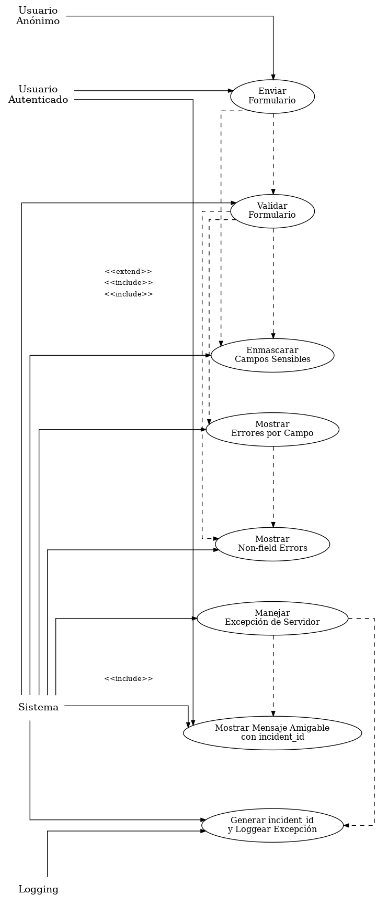
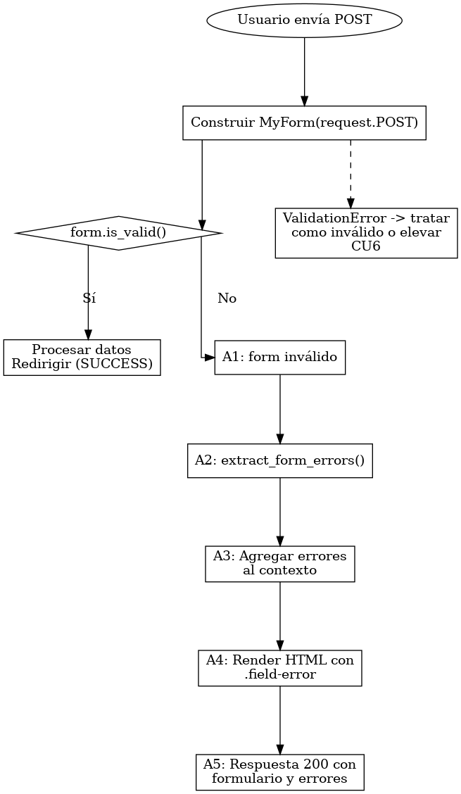
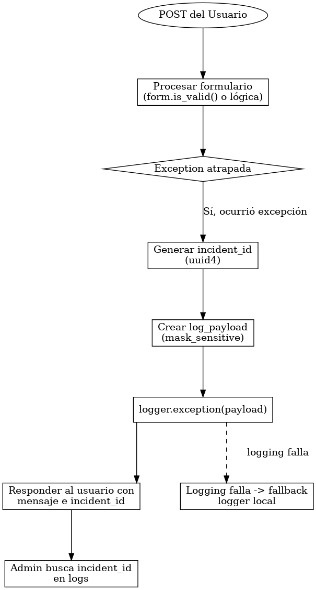
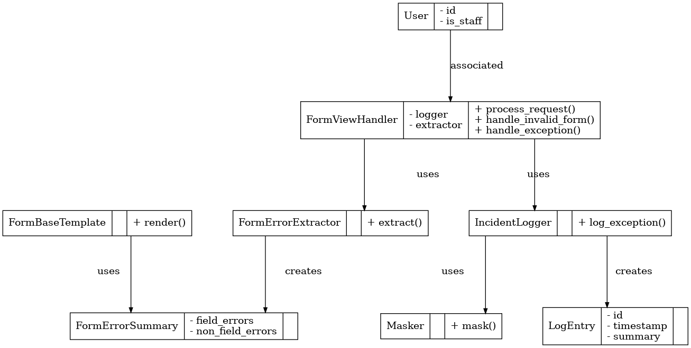
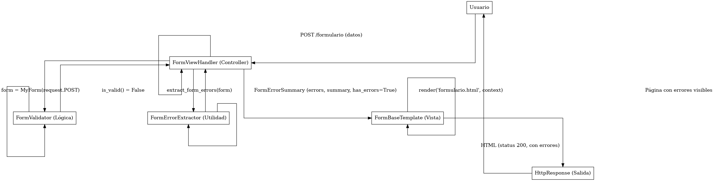
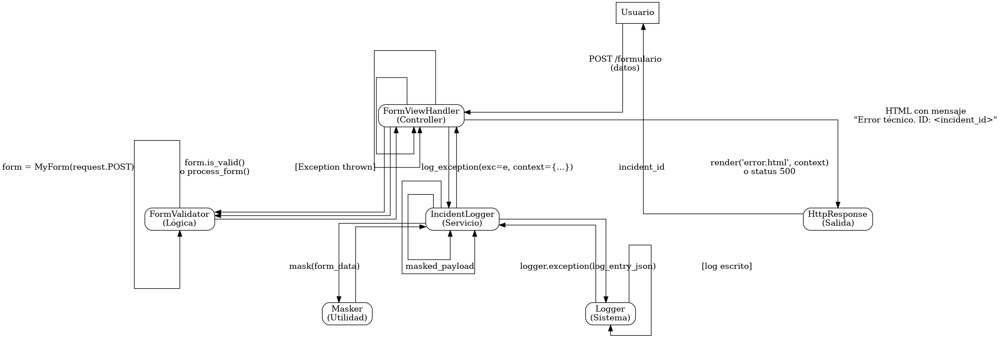
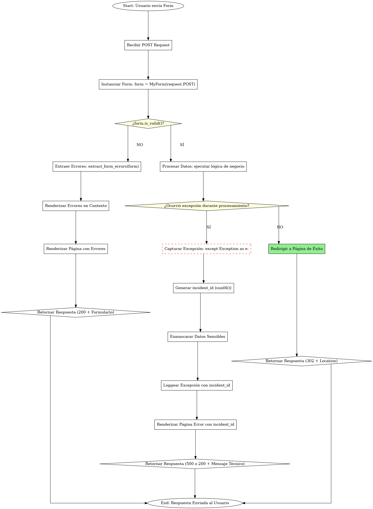
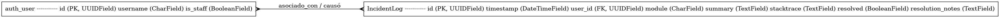

Trabajo de la semana 1 del proyecto final de ie0417

Requerimientos, rediseño y modelado UML del módulo a mejorar

# Informe Técnico

## Índice

- [Introducción al módulo propuesto](#introducción-al-módulo-propuesto)
- [Objetivos y Alcance](#objetivos-y-alcance)
- [Diseño de la solución técnica](#diseño-de-la-solución-técnica)
- [Requerimientos funcionales, no funcionales y restricciones](#requerimientos-funcionales-no-funcionales-y-restricciones)
- [Diagrama UML completo](#diagrama-uml-completo)
- [Arquitectura propuesta](#arquitectura-propuesta)

---

# -> Introducción al módulo propuesto

Durante el análisis técnico realizado en la **Semana 1**, se identificaron diversos problemas de **acoplamiento**, **duplicación de código** y **falta de modularidad**, particularmente en los módulos `views.py` y `forms.py` del sistema **EIEInfo**.  
Actualmente, la gestión de errores en los formularios es **genérica y poco trazable**: los mensajes de error se muestran de forma global o ambigua, sin vincularse al campo específico que los genera. Además, existen bloques `try/except` demasiado amplios o genéricos, lo que **oculta errores reales** y dificulta la depuración durante el desarrollo o en producción.

La ausencia de una estructura clara para manejar y reportar errores impacta tanto en el **usuario final** (mensajes poco informativos, experiencia confusa) como en el **desarrollador** (falta de trazabilidad, dificultad para diagnosticar fallas).  
Esta situación se agrava por la dispersión del manejo de validaciones en múltiples capas (`forms`, `views`, `misc.py`) sin una convención unificada.

---

### **Justificación técnica y funcional**

Técnicamente, la arquitectura del sistema necesita una **refactorización modular del manejo de errores** para aislar esta responsabilidad en componentes reutilizables.  
Esto implica crear una **capa auxiliar (`helpers/errors.py`)** que centralice la normalización, registro y visualización de errores provenientes de formularios y vistas.

Funcionalmente, la propuesta busca resolver tres limitaciones detectadas:
1. **Mensajes genéricos** → el usuario no sabe qué campo falló o por qué.  
2. **Excepciones no controladas** → errores se pierden o no quedan registrados.  
3. **Ausencia de trazabilidad** → no hay una forma sistemática de seguir un error reportado por un usuario.

El nuevo enfoque unifica la forma de **capturar, clasificar y presentar los errores**, y permite instrumentar **logs estructurados con identificadores únicos (UUID)** para correlacionar incidentes entre la capa de aplicación y los registros del servidor.  
Además, esta intervención aprovecha la modularidad de Django y no requiere alterar el modelo de datos ni la estructura del sistema, por lo que es **viable dentro del alcance de 1.5 semanas**.

---

### **Impacto esperado**

| Tipo de impacto | Descripción |
|-----------------|-------------|
| **Arquitectónico** | Se introduce un patrón más limpio y desacoplado para el manejo de errores, mediante un helper centralizado (`helpers/form_errors.py`) y el uso de logging estructurado. Mejora la cohesión interna y reduce duplicaciones en las `views` y `forms`. |
| **Técnico** | Aumenta la trazabilidad de fallos mediante logs con UUID por incidente, mejora el mantenimiento y facilita la depuración. Reduce el uso de excepciones genéricas, alineándose con buenas prácticas de Django. |
| **Funcional** | El usuario recibe mensajes específicos y claros por campo o acción, lo que mejora la experiencia de uso y la confianza en el sistema. |
| **De desarrollo y soporte** | El equipo podrá identificar más rápido el origen de los errores y documentar incidencias con mayor precisión. Esto reduce el tiempo de soporte y agiliza la resolución de fallas. |

---


# -> Objetivos y alcance

## Implementación técnica de la mejora: Manejo estructurado de errores en formularios

### **Objetivo general**

Estandarizar el manejo de errores en formularios, vistas y logs del sistema **EIEInfo**, reemplazando los mensajes genéricos por mensajes específicos, trazables y seguros.  
El propósito es mejorar la experiencia del usuario, facilitar la depuración y documentar un patrón reutilizable para desarrolladores futuros.

---

## **Objetivo 1 — Helper para extracción de errores de formularios**

**Qué se implementa:**  
Una función Python que reciba cualquier `django.forms.Form` y devuelva un diccionario estructurado con la siguiente información:

| Clave | Descripción |
|-------|--------------|
| `errors_by_field` | Diccionario con formato `{nombre_campo: [lista_de_mensajes_str]}` |
| `non_field_errors` | Lista de errores globales no asociados a un campo |
| `summary` | Cadena resumida para logging (ej. `"email: Formato inválido; password: Campo requerido"`) |
| `has_errors` | Booleano que indica si el formulario tiene errores |

**Ubicación:**  
`src/server/misc.py`  
Función: `extract_form_errors(form: forms.Form) -> dict`

**Criterios de aceptación:**
- Recibe un `Form` válido o inválido y siempre retorna un dict, sin lanzar excepciones.  
- Soporta `MultiValueField` (checkboxes, multiselect).  
- Excluye automáticamente campos sensibles en el resumen (`password`, `token`, `api_key`, etc.).  
- Incluye *docstring* con ejemplo de uso y *type hints*.

---

##  **Objetivo 2 — Mejorar plantillas base de formularios**

**Qué se implementa:**  
Actualizar los templates base de formularios para mostrar errores de forma clara y consistente:

1. **Panel de alerta** con los `non_field_errors` en la parte superior.  
2. **Errores por campo** visibles directamente bajo cada input (`{{ field.errors }}`).  
3. **Bloque técnico colapsable** (visible solo si `DEBUG=True` o el usuario es *staff*), mostrando el JSON completo de errores.

**Ubicación:**  
- Archivo principal: `templates/form_base.html`  
- Verificación: todos los templates heredados deben mantener la convención.

**Criterios de aceptación:**
- Errores por campo usan clases `.text-danger` y `.help-block`.  
- Panel de errores globales usa `.alert.alert-danger`.  
- Bloque técnico visible solo en modo *debug* o para usuarios *staff*.  
- Compatible con el CSS existente (Bootstrap 3/4).  
- Todos los formularios del proyecto heredan automáticamente los estilos.

---

##  **Objetivo 3 — Reemplazar excepciones genéricas por manejo específico**

**Qué se implementa:**  
Sustituir bloques `try/except` genéricos en vistas críticas por manejo controlado con trazabilidad.

**Patrón de vista recomendado:**
```python
if not form.is_valid():
    errors = extract_form_errors(form)
    return render(request, "form_template.html", {"form": form, "errors": errors})

try:
    # Lógica de negocio
except ValidationError as e:
    incident_id = uuid4()
    logger.exception(f"[{incident_id}] Error de validación: {e}")
    messages.error(request, f"Ocurrió un error (ID: {incident_id}). Por favor contacte soporte.")
```

##  Objetivo 4 — Implementar *logging* estructurado con ID de incidente

### **Qué se implementa**
Configurar un sistema de *logging* estructurado que permita registrar todos los errores relevantes con suficiente detalle para reproducirlos, depurarlos y trazarlos sin exponer información sensible.

Cada error o excepción deberá generar un **incident_id** (UUID) que permita correlacionar el mensaje mostrado al usuario con la entrada exacta en los logs.

### **Campos que deben registrarse**
- `timestamp` generado automáticamente  
- `level` (ERROR, WARNING, INFO)  
- `incident_id` (UUID v4)  
- nombre del módulo/vista que falló  
- ID del usuario si está autenticado, o `"anonymous"`  
- ruta (`request.path`)  
- *summary* del formulario (sin datos sensibles)  
- stacktrace completo (solo en logs, nunca al usuario)

### **Dónde se implementa**
- Configuración del diccionario `LOGGING` en `settings.py`  
- Uso explícito del logger en:
  - `estudiantes/views/asistencias.py`
  - `publico/views/publico.py`

### **Criterios de aceptación**
- Los logs se registran correctamente en `django.log` o consola.  
- Todos los registros de excepción incluyen `incident_id`.  
- Ni contraseñas ni tokens aparecen en el log.  
- Los datos registrados permiten reproducir el error.  

---

##  Objetivo 5 — Actualizar mensajes al usuario para que sean específicos y útiles

### **Qué se implementa**
Reemplazo de mensajes genéricos (“Formulario inválido”) por mensajes específicos, accionables y entendibles.  
Los mensajes deben:

- Identificar claramente el campo con error  
- Indicar la razón  
- Sugerir una acción cuando sea útil  
- Evitar exponer información técnica o sensible  

### **Ejemplos antes/después**
| Caso | Antes | Después |
|------|--------|---------|
| Email inválido | “Formulario inválido” | “El campo *Correo* debe tener formato usuario@ucr.ac.cr.” |
| Contraseña corta | “Formulario inválido” | “La contraseña debe tener al menos 8 caracteres.” |
| Error desconocido | “Error al registrar…” | “Ocurrió un error inesperado (ID: ab12cd34). Contacte soporte.” |

### **Criterios de aceptación**
- Los mensajes por campo provienen de validadores en Django (`clean()`, `validators`).
- Los mensajes de excepción incluyen solo el ID de incidente.
- Los usuarios pueden entender qué hacer sin asistencia en la mayoría de los casos.

---

## Alcance puntual del desarrollo (IN SCOPE / OUT OF SCOPE)

### **IN SCOPE — Lo que sí se implementa**
1. **Helper `extract_form_errors()`**  
   - Recibe cualquier `Form`, `ModelForm` o `FormSet`.  
   - Devuelve siempre un diccionario con `errors_by_field`, `non_field_errors`, `summary` y `has_errors`.  
   - Excluye automáticamente campos sensibles en el resumen.  
   - No lanza excepciones aunque el formulario esté incompleto.

2. **Template base mejorado (`form_base.html`)**  
   - Panel global de errores (`non_field_errors`).  
   - Errores por campo debajo del input.  
   - Bloque técnico `<details>` visible solo si `DEBUG=True` o usuario es *staff*.  
   - Uso de clases Bootstrap existentes.

3. **Vistas modificadas (refactor controlado)**  
   - `asistencia_detail()` en `asistencias.py`  
   - `index()` y `recuperar_password()` en `publico.py`  
   - Se implementa el patrón:
     - Validar → Mostrar errores  
     - Excepción → UUID + logger  
     - Éxito → mensaje de confirmación  

4. **Logging estructurado**  
   - Diccionario `LOGGING` funcional en `settings.py`.  
   - Formato incluye: `incident_id`, `view`, `user`, `path`, `summary`.  
   - Stacktrace completo en logs.

5. **Pruebas automatizadas**  
   - `extract_form_errors` con formularios válidos e inválidos.  
   - Manejo de errores en vistas.  
   - Verificación de presencia de `incident_id` en respuestas y logs.

6. **Documentación técnica**  
   - Archivo `docs/ERROR_HANDLING.md`.  
   - Ejemplos, patrones, checklist para nuevas vistas.

---

### **OUT OF SCOPE — Lo que NO se implementa**
- Integración con herramientas externas (Sentry, DataDog).  
- Creación o modificación de tablas en la base de datos.  
- Refactor completo de todos los formularios del sistema.  
- Cambios de frontend avanzados (modales, AJAX).  
- Internacionalización (solo mensajes en español).  
- Cambios de librerías o dependencias.  
- Funcionalidades nuevas fuera del manejo de errores.  

---

##  Especificaciones técnicas detalladas

### **Estructura de salida del helper**
```json
{
  "errors_by_field": {
    "email": ["Formato inválido"],
    "password": ["Campo requerido"]
  },
  "non_field_errors": ["No se pudo procesar el formulario"],
  "summary": "email: Formato inválido; password: Campo requerido",
  "has_errors": true
}
```

# -> Requerimientos funcionales, no funcionales y restricciones

# Requerimientos del Sistema  
*(Mejoras al manejo de errores y validación de formularios en EIEInfo)*

A continuación se presentan los requerimientos del sistema clasificados en **Funcionales**, **No Funcionales** y **Restricciones**, redactados siguiendo las buenas prácticas del documento *Casos de Uso y Requerimientos de Software*.  
Cada requerimiento incluye un **criterio de aceptación medible**.

---

# 1. Requerimientos Funcionales 

### **F1 — Validación y despliegue de errores por campo**  
El sistema deberá permitir validar en el servidor cualquier formulario enviado y mostrar en el HTML resultante los errores por campo, aplicando una clase CSS estandarizada (`.field-error`) en cada elemento con error.

**Criterio de aceptación:**  
Al enviar un formulario inválido, la respuesta HTTP es 200 y el HTML contiene un elemento con `.field-error` por cada campo con error.

---

### **F2 — Extracción estructurada de errores con helper**  
El sistema deberá permitir obtener los errores de cualquier formulario mediante la función `extract_form_errors(form)`, que retornará:  
`errors_by_field`, `non_field_errors`, `summary`, `has_errors`.

**Criterio de aceptación:**  
Un test comprueba que, con un formulario inválido, `errors_by_field` contiene listas no vacías y `summary` mide < 200 caracteres.

---

### **F3 — Registro de excepciones con incident_id**  
El sistema deberá generar un identificador único (UUID v4) para cualquier excepción no prevista, registrar el error completo con `logger.exception()` y asociarlo al incidente.

**Criterio de aceptación:**  
Una prueba que induce una excepción verifica que el log contiene un UUID válido y la traza completa, y la respuesta HTTP contiene el mismo UUID.

---

### **F4 — Mensaje de error al usuario con correlación**  
El sistema deberá mostrar un mensaje estándar:  
**“Ha ocurrido un error técnico. Reporte ID: <incident_id>”.**

**Criterio de aceptación:**  
En un escenario de excepción controlada, la respuesta al usuario incluye el mensaje y un incident_id válido según expresión regular de UUID.

---

### **F5 — Enmascarado de campos sensibles en logs**  
El sistema deberá enmascarar valores sensibles (`password`, `confirm_password`, `card_number`, etc.) antes de escribir cualquier registro en los logs.

**Criterio de aceptación:**  
Un test que envía valores sensibles confirma que estos no aparecen en logs y que fueron reemplazados por `***`.

---

### **F6 — Bloque técnico de depuración condicionado**  
El sistema deberá incluir en `form_base.html` un bloque colapsable con detalles técnicos visible solo si `DEBUG=True` o si el usuario es *staff*.

**Criterio de aceptación:**  
Con `DEBUG=True` el HTML contiene `#debug-form-errors`; con `DEBUG=False` y usuario no staff el bloque no aparece.

---

### **F7 — Plantilla base única para formularios**  
El sistema deberá proporcionar una plantilla base `form_base.html` que todos los formularios del proyecto puedan extender, incluyendo secciones para errores globales y por campo.

**Criterio de aceptación:**  
Al menos tres formularios existentes extienden `form_base.html` y una prueba confirma la presencia de `non_field_errors` en el HTML.

---

### **F8 — Cobertura mínima de pruebas**  
El sistema deberá incluir pruebas automatizadas que cubran: validación, helper de errores, logging con incident_id y enmascarado de datos sensibles.

**Criterio de aceptación:**  
Existe `tests/test_form_error_handling.py`, todos los tests pasan y la cobertura de las funciones nuevas es ≥ 80%.

---

# 2. Requerimientos No Funcionales

### **N1 — Seguridad de logs**  
Los logs no deberán contener datos sensibles ni información de identificación personal.  
El incident_id permitirá rastreo sin exponer información privada.

**Criterio de aceptación:**  
Un script de auditoría detecta 0 coincidencias de valores sensibles en logs de prueba.

---

### **N2 — Rendimiento aceptable**  
La extracción y estructuración de errores no deberá aumentar la latencia en más de 20 ms en promedio bajo carga ligera.

**Criterio de aceptación:**  
Un benchmark confirma que el incremento de latencia ≤ 20 ms.

---

### **N3 — Usabilidad y claridad en mensajes de error**  
Los mensajes presentados al usuario deberán ser comprensibles, orientados a la acción y sin detalles técnicos.

**Criterio de aceptación:**  
Un test verifica que al menos el 95% de los mensajes simulados contienen texto claro y no muestran trazas técnicas.

---

### **N4 — Escalabilidad del logging**  
Los logs deberán generarse en un formato estructurado (JSON o similar) para permitir su exportación a sistemas externos.

**Criterio de aceptación:**  
Un script de ingestión acepta los logs generados sin transformaciones adicionales.

---

### **N5 — Mantenibilidad y documentación**  
La nueva funcionalidad deberá documentarse en `docs/ERROR_HANDLING.md`, con ejemplos de uso y convenciones.

**Criterio de aceptación:**  
El archivo existe y contiene secciones para: resumen, uso del helper, estructura de logs, ejemplos y checklist.

---

# 3. Restricciones

### **R1 — No agregar dependencias externas**  
No se permitirá integrar servicios adicionales como Sentry ni agregar paquetes nuevos en `requirements.txt`.

**Criterio de aceptación:**  
`requirements.txt` permanece sin cambios.

---

### **R2 — Prohibido registrar valores sensibles en logs**  
Los valores reales de campos sensibles están prohibidos en cualquier log y deberán ser enmascarados.

**Criterio de aceptación:**  
Un grep automático sobre logs de prueba retorna 0 coincidencias con valores sensibles.

---

### **R3 — Compatibilidad hacia atrás con vistas existentes**  
Los cambios no deben alterar URLs ni romper formularios ya implementados.

**Criterio de aceptación:**  
La suite de regresión existente pasa sin fallos y los formularios no modificados siguen funcionando correctamente.


# -> Diagramas UML completos
























# -> Arquitectura propuesta

### **Capas y Componentes del Sistema:**

#### **Presentación / UI (Layer 1):**
- **Componentes:** 
  - Vistas Django (`FormViewHandler` wrappers).
  - Plantillas (`form_base.html` y templates específicos para formularios).
- **Responsabilidad:** 
  - Recibir las solicitudes HTTP (POST/GET).
  - Mostrar formularios con errores visibles por campo y mensajes para el usuario.

#### **Aplicación / Servicio (Layer 2):**
- **Componentes:**
  - Lógica de orquestación para procesar formularios (Clase `FormViewHandler`).
  - Validaciones de negocio y control de flujo (ej. `redirects`, `transacciones`).
- **Responsabilidad:** 
  - Coordinar la validación de datos.
  - Controlar el flujo de operaciones (ej. si el formulario es válido, redirigir; si es inválido, procesar errores).

#### **Dominio / Utilidades (Layer 3):**
- **Componentes:**
  - `FormErrorExtractor`: Extrae errores estructurados.
  - `Masker`: Enmascara datos sensibles.
  - `IncidentLogger`: Encapsula el logging estructurado.
- **Responsabilidad:** 
  - Producir resúmenes de errores.
  - Enmascarar datos sensibles antes de loggearlos.
  - Generar `incident_id` únicos y registrar eventos en el log.

#### **Persistencia / Infraestructura (Layer 4):**
- **Componentes:**
  - Base de datos (opcional para almacenar `IncidentLog`).
  - Archivos de log.
  - Configuración de logging en `settings.py`.
  - Sistema de agregación de logs (futuro).
- **Responsabilidad:** 
  - Almacenar los eventos de logs (si aplica).
  - Exponer logs para análisis de incidencias.

---

## 2. Patrones de Diseño Recomendados

### **MVC (Model-View-Controller)**
- **Uso:** Mantener la estructura base de Django.
  - **View**: Controla el flujo.
  - **Template**: Proporciona la vista.
  - **Model**: Gestiona la persistencia.

### **Strategy** (para Masking y FormError Formatting)
- **Uso:** `Masker` actúa como una estrategia configurable, permitiendo diferentes métodos de enmascarado de datos.

### **Singleton / Provider** (para IncidentLogger)
- **Uso:** `IncidentLogger` se mantiene como un singleton, asegurando la consistencia del logger en todo el sistema.

### **Facade / Helper** (para FormViewHandler)
- **Uso:** `FormViewHandler` actúa como fachada para las vistas que procesan formularios, ofreciendo métodos unificados para manejar excepciones y procesar la solicitud.

### **Data Transfer Object (DTO) / Value Object**
- **Uso:** `FormErrorSummary` es un DTO para transportar errores entre el extractor y el template/logger.

### **Observer / Event** (opcional)
- **Uso:** Emitir eventos como `on_incident_logged` para notificar a otros sistemas si es necesario (SaaS, alertas externas).

### **Adapter** (para integrar con diferentes backends de logging)
- **Uso:** Adaptador para enviar logs a diferentes backends (archivo, DB o sistemas externos) sin afectar el core de `IncidentLogger`.

---

## 3. Validaciones a Implementar

### A) **Validaciones de Formulario (Campo y Cross-field)**

#### **V1. Campo Requerido**
- **Descripción:** Verificar que los campos `required=True` sean completados.
- **Criterio de aceptación:** Al enviar un formulario con un campo vacío, debe mostrarse el mensaje "El campo X es obligatorio" con la clase `.field-error` aplicada.

#### **V2. Formato y Tipo**
- **Descripción:** Validación de formatos (ej. correos, fechas, números).
- **Criterio de aceptación:** Si un campo tiene un valor fuera del formato esperado, el mensaje de error debe ser claro y el campo debe tener la clase `.field-error`.

#### **V3. Validación Cross-field**
- **Descripción:** Validaciones que dependen de más de un campo (ej. `password == confirm_password`).
- **Criterio de aceptación:** Si los campos no coinciden, deben ser añadidos a `non_field_errors` y se debe mostrar el error en el HTML.

#### **V4. Validación de Unicidad/Negocio**
- **Descripción:** Validación de duplicados antes de persistir.
- **Criterio de aceptación:** Un intento de crear un recurso duplicado debe devolver un error de validación y no persistir.

#### **V5. Sanitización de Entrada HTML**
- **Descripción:** Sanitizar entradas de texto que puedan contener código HTML.
- **Criterio de aceptación:** Cualquier entrada que contenga `<script>` debe ser sanitizada antes de ser almacenada.

#### **V6. Tamaño del Payload**
- **Descripción:** Validar límites en el tamaño de los campos y del request.
- **Criterio de aceptación:** Si un formulario excede el tamaño permitido, debe devolver un error de validación HTTP 413.

---

### B) **Validaciones de Seguridad y Privacidad**

#### **S1. No Loggear Campos Sensibles**
- **Descripción:** Evitar que campos sensibles como `password`, `confirm_password`, `card_number` se registren en los logs.
- **Criterio de aceptación:** Los valores sensibles deben ser reemplazados por `***` antes de ser registrados.

#### **S2. CSRF y Autenticación**
- **Descripción:** Asegurarse de que solo los usuarios autenticados puedan enviar formularios protegidos por CSRF.
- **Criterio de aceptación:** Las vistas que requieren autenticación deben redirigir o devolver un error 403 si el usuario no está autenticado.

#### **S3. Rate Limiting / Anti-spam**
- **Descripción:** Limitar la cantidad de envíos de formularios para prevenir abusos.
- **Criterio de aceptación:** Después de N intentos fallidos, bloquear temporalmente al usuario y devolver un error 429.

#### **S4. Control de Debug**
- **Descripción:** Mostrar detalles técnicos solo cuando `DEBUG=True` y el usuario es staff.
- **Criterio de aceptación:** En producción, nunca se debe mostrar una traza de excepción o detalles técnicos.

---

### C) **Validaciones Operacionales**

#### **O1. Límite de Tamaño del Payload en Logs**
- **Descripción:** Limitar el tamaño del resumen del payload registrado en los logs.
- **Criterio de aceptación:** El resumen de los logs debe tener un tamaño máximo configurado (ej. 10KB).

#### **O2. Integridad de incident_id**
- **Descripción:** Validar que `incident_id` es un UUID v4 válido.
- **Criterio de aceptación:** El `incident_id` debe coincidir con el formato UUID v4 y debe ser correlacionable con el log.

---

## 4. Posibles Riesgos y Mitigaciones

### **Riesgo R1 — Exposición de Datos Sensibles**
- **Mitigación:**
  - Implementar `Masker` para filtrar y enmascarar valores sensibles antes de loggearlos.
  - Validar la implementación con pruebas automáticas.

### **Riesgo R2 — Exposición de Información Técnica**
- **Mitigación:**
  - Mostrar detalles técnicos solo a usuarios con `DEBUG=True` o si `user.is_staff`.
  - Revisión de código para asegurar que no se filtran detalles sensibles en producción.

### **Riesgo R3 — Desempeño del Logging**
- **Mitigación:**
  - Implementar logging asíncrono para reducir la carga de trabajo en tiempo de ejecución.
  - Asegurarse de que el rendimiento de la aplicación no se vea afectado significativamente por el logging.

---

## 5. Plan de Mitigación de Despliegue

### **Fase 0 — Preparación:**
- Desarrollar helpers y pruebas unitarias.
- Crear documentación de convenciones en `docs/ERROR_HANDLING.md`.

### **Fase 1 — Aplicación Piloto:**
- Aplicar cambios a 1–2 vistas no críticas y desplegar a staging.
- Ejecutar pruebas de usabilidad y latencia.

### **Fase 2 — Monitoreo y Ajustes:**
- Monitorear logs, latencia y volumen.
- Revisar la efectividad de las estrategias de enmascarado.

### **Fase 3 — Rollout Completo:**
- Desplegar los cambios a todas las vistas.
- Archivar y documentar los aprendizajes del proceso.

---

# -> Plan de implementación (roadmap técnico semana 3)

# Roadmap Técnico - Semana 3

## **Objetivo de la Semana 3: Implementación del Módulo o Mejora**

El objetivo principal de esta semana es **construir la solución** propuesta siguiendo el diseño aprobado en la semana 2 y aplicando las mejores prácticas de ingeniería de software, incluyendo control de versiones, pruebas, modularidad, y desarrollo de funcionalidades tanto en backend como en frontend.

### **Tareas Obligatorias Paso a Paso:**

---

## **1. Preparación Técnica:**

### a. **Creación del Repositorio Individual:**
- Crear un repositorio individual en Git con las siguientes ramas:
  - `main`: rama principal con código aprobado.
  - `dev`: rama de desarrollo para implementaciones continuas.
  - `feature/<nombre>`: ramas específicas para cada característica nueva.
  
### b. **Documento de Instalación y Ejecución del Entorno:**
- Documentar detalladamente el proceso de instalación, configuración y ejecución del entorno en local, incluyendo los pasos para ejecutar el servidor, base de datos y configuraciones adicionales.
  
### c. **Base de Datos:**
- Asegurarse de que la base de datos esté lista con los scripts de creación de tablas (`migrations`), configuraciones de conexión y, si es necesario, datos iniciales (scripts `seed`).

---

## **2. Implementación del Backend:**

### a. **Estructura del Backend:**
- Implementar las clases, servicios y controladores necesarios definidos en la Semana 2.
  - **Clases**: Definir las clases de los módulos que serán modificados o agregados.
  - **Servicios**: Crear servicios reutilizables que faciliten la lógica de negocio.
  - **Controladores y Validadores**: Desarrollar controladores para manejar las solicitudes y validadores para garantizar la integridad de los datos.
  
### b. **CRUD Completo si Aplica:**
- Asegurarse de implementar el ciclo completo de **Crear, Leer, Actualizar y Eliminar** (CRUD) para los módulos afectados.

### c. **Manejo de Errores y Validaciones:**
- Asegurarse de que todos los errores se gestionen adecuadamente y de que las validaciones necesarias estén implementadas correctamente. El manejo de excepciones debe ser específico y no genérico.

### d. **Log Interno o Mensajes de Depuración:**
- Implementar un sistema de logging interno para registrar eventos importantes, errores y excepciones que ocurran durante el proceso. Sin almacenar información sensible.

---

## **3. Implementación del Frontend/UI:**

### a. **Desarrollo de Páginas y Formularios:**
- Crear las páginas necesarias para el nuevo módulo o mejora, incluyendo formularios que interactúen con el backend.
  
### b. **Validaciones Visuales:**
- Implementar validaciones visuales en los formularios, como la validación de campos en tiempo real o al hacer submit.

### c. **Flujo de Navegación Funcional:**
- Desarrollar el flujo de navegación funcional entre las diferentes páginas del sistema, garantizando que los usuarios puedan realizar todas las acciones requeridas.

### d. **Mensajes de Retroalimentación al Usuario:**
- Implementar mensajes de retroalimentación claros para el usuario, tanto en caso de éxito como de error (conforme a los mensajes especificados en los objetivos previos).

### e. **Diseño Limpio y Usabilidad:**
- Asegurarse de que el diseño sea coherente, fácil de usar y estéticamente limpio, siguiendo los lineamientos básicos de usabilidad (como la separación de contenido, botones claros, etc.).

---

## **4. Integración y Pruebas Internas:**

### a. **Casos de Prueba:**
- Desarrollar un conjunto mínimo de **10 casos de prueba funcionales** que cubran la funcionalidad principal del módulo o mejora.
  
### b. **Corrección de Errores:**
- Corregir cualquier error que se haya encontrado durante las pruebas y realizar ajustes necesarios.

### c. **Registro de Bugs y Soluciones:**
- Mantener un registro de todos los errores o bugs encontrados y cómo se resolvieron.

---

## **5. Documentación Técnica:**

### a. **README Completo:**
- Crear un archivo `README` detallado con todas las instrucciones de ejecución, descripción del módulo, dependencias y cualquier configuración especial que se requiera.

### b. **Diagrama Final de Arquitectura del Módulo Implementado:**
- Actualizar el diagrama de arquitectura para reflejar la versión final del módulo o mejora implementada.

---

**Entregables Semana 3:**

1. **Repositorio con Código Funcional**:  
   El código debe ser funcional y subido a GitHub, con las ramas de `main`, `dev` y las ramas de características específicas.

2. **Evidencias Visuales**:  
   Incluir capturas de pantalla que demuestren que la implementación está funcionando correctamente.

3. **Documento Técnico**:  
   Un documento con:
   - **Decisiones de Diseño Finales**.
   - **Cambios Respecto al Plan Original**.
   - **Limitaciones Técnicas**.

